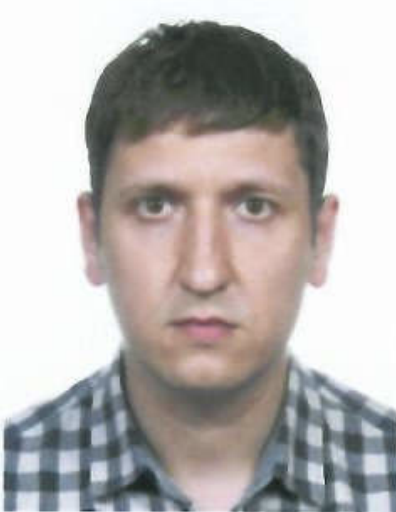

Bersenev Sergey
Location: Novosibirsk, Russian Federation
Contact: tel. +79137119237,
e-mail s.s.bersenev@gmail.com

Job Experience:
2020/04 – present day GE Healthcare LLC (Medical Systems), position: Advanced Field Service Engineer.
Duties:
Performing of deep service procedures in medical systems (high level of troubleshooting, lead engineer during installation visit), support of Service Sales Team and Remote Service Team, technical mentoring of newcomer FEs.

2014/06 – 2020/04, GE Healthcare LLC (Medical Systems), position: Field Service Engineer.
Duties:
Performing of service procedures in medical systems: Biomed systems – Anesthesia and Respiratory systems, Infant Care systems, Monitoring solution, Cardiology, and DI systems – Vascular, Mammo, Densitometry (BMD), X-Ray systems. Performing routine maintenance tasks, warranty and non-warranty repairs, troubleshooting, commissioning оf new equipment. Consultancy of customers and discussion of operating problems.

Education:
2002 – 2008, Novosibirsk State Technical University, specialty: Engineer, Technical Operation of Aircraft and Gas-Turbine Engines.

Special Skills:
Experienced computer user: knowledge of office and internet software, base knowledge of Database and CAD software, IT Network Technology
Proficiency in English

Personal qualities:
Easy learning, responsibility to work, desire to professional growth, priority selection ability.

Hobby:
Roller skating, sport shooting (Range Officer and member of Regional Shooting Team).